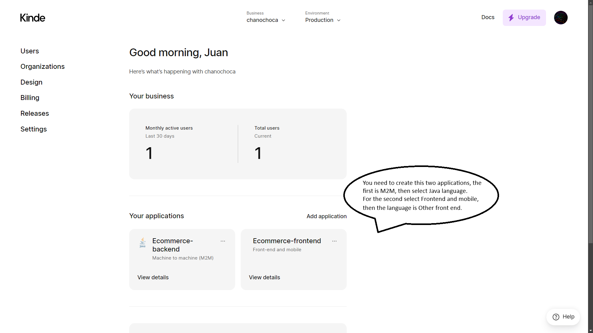

# Ecommerce Spring Boot Angular

## Toos Used

- Java 22
- Maven
- Kinde
- Stripe
- PostgreSQL

## Testing

- Fill credentials in [application.yml](src/main/resources/application.yml).
- Open Docker Desktop.
- Configure database in IntelliJ, with database named `ecommerce` and schema named `ecommerce`.
- Run project.

## Instructions for use Kinde

* If it is not working, try to update the clock time of your computer, it is a rare cause but it can work.
